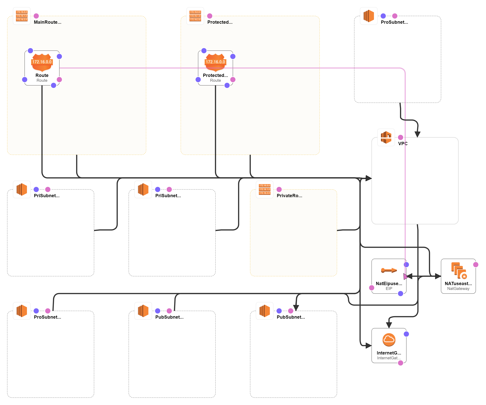

## Assignment
### This python script genaretes Cloudformation template using troposphere.

In order to run the script run the following commands:

``` pip install troposphere ```

``` python app.py ```

A python script was written to create three separate VPCs named 'Growth-Dev', 'Growth-Stage', 'Growth-Prod' using the Troposphere library.

Since this application is interactive while running, it needs to get some information from the user.
First information is which type of VPC requested by the user, and secondly which AWS region this VPC will be in.

By providing this information, in the desired region,
A custom template can be created that consists of the VPC types specified in the assignment and contains multiple AZs..

A template was created using this script to be a proof of concept. With this template;
One VPC in two AZs in us-east-1 region for the 'Growth-Dev' account mentioned in the Assignment,
Within this VPC, one Private Subnet, one Public Subnet, one Protected subnet have been created for each AZ, with CIDR blocks as specified in the assignment.

### The created architecture is as follows.




The public subnet of each availability zone is attached directly to a Internet Gateway, and the protected subnet is attached a NAT Gateway in the availability zone. There is also set up for EIP and Routing Tables within this subnet which is used for effectively routing the protected subnet's data.

The use of the NAT Gateway ensures that the outside world cannot get into anything inside the protected subnet, but the protected subnet can talk to the outside world, traffic for the protected subnet can first hit the NAT and pass it on depending on the NAT gateway itself.

The created template was launched in AWS Cloud formation for validation and tested. It works fine.

### Resources
<https://www.davidc.net/sites/default/subnets/subnets.html> (Resource for the Subnet Calculator)
<https://github.com/cloudtools/troposphere> (Python library to create AWS CloudFormation descriptions)
<https://github.com/SuleymanBat/aws-cloudformation-user-guide>
